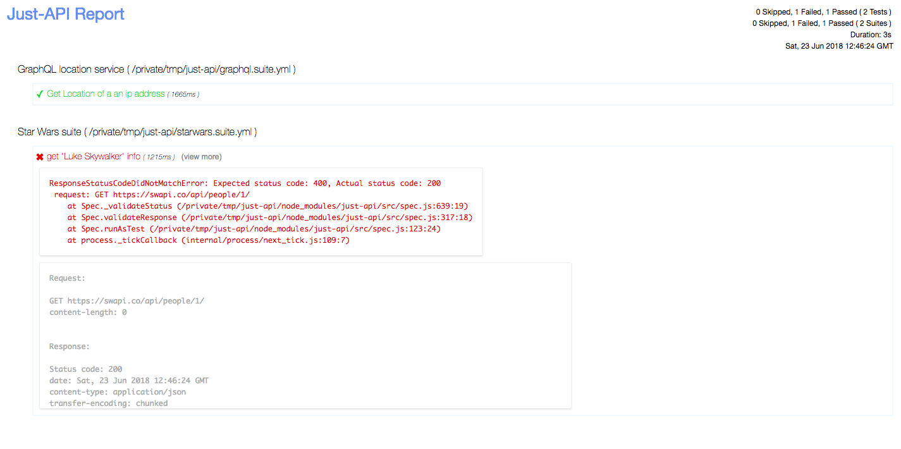

# 记者

### 生成报告

Just-API有几个内置记者,`json`,`specs`,`html`等等

当您需要HTML报告时,可以调用just-api`--reporter`选项

```sh
./node_modules/.bin/just-api --reporter html
```

#### 一个示例html报告: 



*请注意,报告包含失败测试的请求和响应详细信息*

### 以多种格式生成报告

Just-API可以生成多种格式的报告. 

当您还需要HTML报告和JSON报告时,您可以执行类似的操作

```sh
./node_modules/.bin/just-api --reporter html,json
```

这样,您可以为同一次运行生成多种格式的报告. 

### 自定义记者

当内置记者无法提供您需要的信息时,您可以编写自定义记者并使用它: 

```sh
./node_modules/.bin/just-api --reporter html,custom-reporter-module-name
```

或者如果记者是本地js文件

```sh
./node_modules/.bin/just-api --reporter html,/absolute/path/to/js/file
```

Just-API中的记者是JavaScript构造函数. 实例化时,报告者会收到测试启动器对象以及程序选项. 

Just-API在启动器对象和套件对象上发出事件,因此自定义报告者应该监听这些事件并实现报告. 

在启动器对象上发出以下事件

-   开始
-   结束
-   新套件 (表示新套件的开始) 

    以下事件在每个套件对象上发出

-   测试通过
-   测试失败
-   测试跳过
-   结束 (表示套件的结束) 

如果您正在寻找自定义记者,请查看Just-API[JSON记者](https://github.com/kiranz/just-api/blob/master/lib/reporters/json.js) 

### 记者选项

Just-API接受一个额外的命令行选项`--reporter-options`您可以使用它来自定义生成和保存报告的方式和位置. 

您必须将逗号分隔的键和值对列表传递给此选项`k=v,k2=v2,...`

目前支持以下键. 

-   jsonReportDir
-   jsonReportName
-   htmlReportDir
-   htmlReportName
-   logRequests

`jsonReportDir`: 提供与Just-API节点进程的cwd相关的现有目录路径. JSON报告将保存到此目录中. 

`htmlReportDir`: 提供与Just-API节点进程的cwd相关的现有目录路径. HTML报告将保存到此目录中. 

`jsonReportName`: 提供JSON报告文件的名称. JSON报告将以此名称保存. 

`htmlReportName`: 提供HTML报告文件的名称. HTML报告将以此名称保存. 

`logRequests`: 告诉Just-API在报告中记录失败测试的HTTP请求和响应详细信息. 如果您不想记录详细信息,请忽略此项. 

Just-API调用示例如下所示: 

```sh
./node_modules/.bin/just-api --reporter html,json --reporter-options jsonReportDir=reports,jsonReportName=json-report,htmlReportDir=reports,htmlReportName=html-report,logRequests     
```
